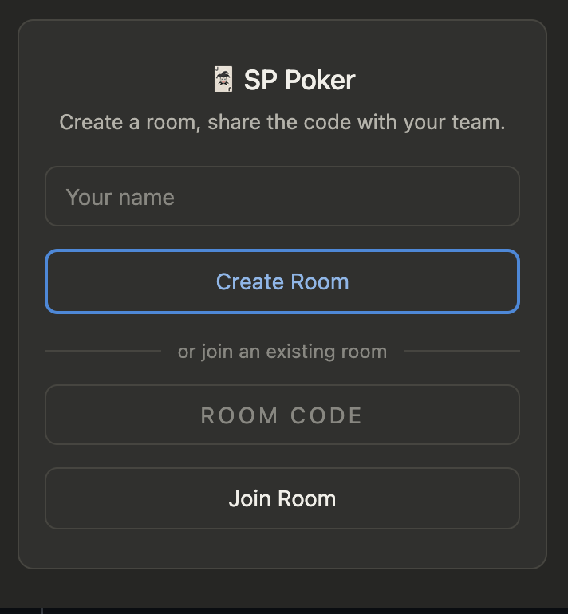
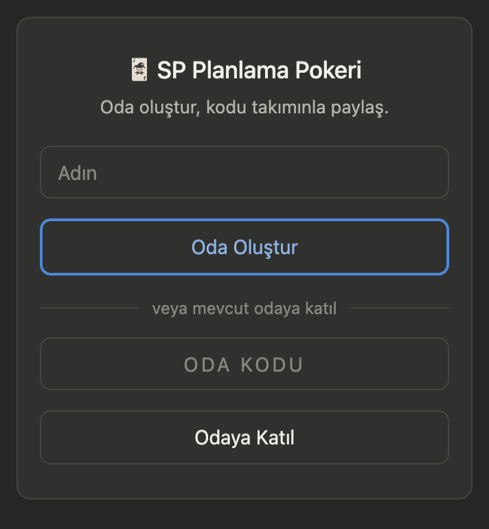

# SP Poker

Real-time sprint planning poker for teams — a lightweight Chrome extension backed by Firebase Realtime Database. Create a room, share the code, vote on story points with Fibonacci cards, and reveal results together.

| English | Türkçe |
|---|---|
|  |  |

## Features

- Create a room and get a 6-character code to share with your team
- Vote on tasks using Fibonacci story points
- Votes stay hidden until the host reveals them
- Host sets the final story point and moves to the next task
- Session persists across popup close/reopen via `chrome.storage`
- History of completed tasks and their story points
- Full English/Turkish localization (follows your browser's UI language)
- Names, task IDs, and notes are encrypted per room before being stored in Firebase

## Installation (for users)

1. Download or clone this repo
2. Set up your own Firebase project — see [SETUP.md](SETUP.md)
3. `chrome://extensions/` → enable **Developer mode** → **Load unpacked** → select this folder

> SP Poker is published on the Chrome Web Store.

## Tech stack

- Vanilla JS, HTML, CSS — no build step
- Manifest V3 Chrome extension
- Firebase Realtime Database (REST API via `fetch`, no SDK bundled)

## Project structure

```
manifest.json              Chrome extension manifest (MV3)
popup.html / popup.css / popup.js   Extension UI and logic
firebase-config.example.js Template for your own Firebase credentials
icons/                      Extension icons
.github/workflows/          CI/CD: auto-publish to Chrome Web Store on push to main
store-assets/                Privacy policy + Chrome Web Store screenshot
```

## Setup & deployment

Full Firebase setup, Realtime Database rules, and Chrome Web Store CI/CD instructions are in [SETUP.md](SETUP.md).

## Contributing

Contributions are welcome — see [CONTRIBUTING.md](CONTRIBUTING.md).

## License

[MIT](LICENSE)
